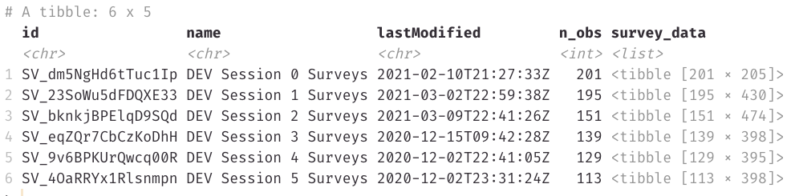

```{r, include = FALSE}
options(rmarkdown.html_vignette.check_title = FALSE)
knitr::opts_chunk$set(
  collapse = TRUE,
  comment = "#>"
)
```

This package is designed to retrieve raw data from the Devaluation study from two sources -- questionnaires administered via [Qualtrics](https://www.qualtrics.com/) and a host of measures collected via [Redcap](https://www.project-redcap.org/), including outcome measures such as body mass, BMI, and hip-waist ratio. 

These data are collected from participants across 6 sessions: 

```{css echo = FALSE}
thead {
  background-color: #2C3E50;
  color: #fff;
}
```

```{r echo = FALSE}
session_data <- data.frame(
  Session = paste("Session", 0:5),
  `Study timepoint` = c(
    "Initial visit",
    "Pre-intervention",
    "Post-intervention",
    "3-month follow-up",
    "6-month follow-up",
    "12-month follow-up"
    )
)
library(magrittr)
knitr::kable(session_data, 
             col.names = c("Session", "Study timepoint"),
             escape = FALSE) %>% 
  kableExtra::kable_styling(
    c("striped", "hover"),
    full_width = TRUE
  )
```

**Note.** Data are currently not publicly available, as data collection is ongoing, so the examples included here demonstrate code usage only and do not include output.

## API credentials file

To access data, you will need a credentials file, saved in .csv format, that contains valid API tokens for Qualtrics and Redcap, along with the proper UO-specific base URL for each platform. (The example shown here does not contain valid tokens.)

The credentials file should take the following form:

```{r message=FALSE, echo = FALSE}
library(readr)
read_csv("credentials.csv")
```

## Qualtrics

To access survey data from Qualtrics, first register your Qualtrics credentials in your current R session by passing the path to where your credentials file is saved to `register_qualtrics_credentials()`.

```{r eval=FALSE}
library(devaluation)
register_qualtrics_credentials(path_to_creds = "credentials.csv")
```

Once your credentials are registered, you can use `get_survey_info()` to obtain metadata about Qualtrics surveys, including the date each survey was last modified and the number of observations collected.

```{r eval=FALSE}
survey_metadata <- get_survey_info()
survey_metadata
```



To include the raw data along with survey metadata, set `append_raw_data = TRUE`. This returns a nested tibble in which raw data are saved as a list column.

```{r eval=FALSE}
survey_raw_data <- get_survey_info(append_raw_data = TRUE)
survey_raw_data
```

You can also retrieve raw survey data for a given session with `get_survey_responses_raw()`.

```{r eval=FALSE}
session_3 <- get_survey_responses_raw(session = 3)
session_3
```

## Redcap

The package also facilitates the retrieval of data from Redcap with the `get_redcap_raw()` function. Rather than register your Redcap credentials in your session, simply feed this function the path to your credentials file with the `path_to_creds` argument.

```{r eval=FALSE}
redcap_raw <- get_redcap_raw(path_to_creds = "credentials.csv")
redcap_raw
```

By default, identifiable information is excluded when retrieving raw Redcap data. To include identifiable variables, you must set `identifiable = TRUE`.

```{r eval=FALSE}
redcap_identifiable <- get_redcap_raw(path_to_creds = "credentials.csv", identifiable = TRUE)
redcap_identifiable
```
